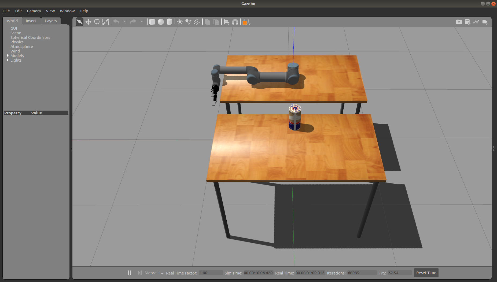

# UR5 Simulation

## Overview

This ROS package aims to provide an environment to spawn the UR5 arm with Robotiq 2F 140 Gripper on a Gazebo world with two tables and a beer can, as can seen below.

**Keywords:** ur5, robotiq, gazebo

### License

The source code is released under a [MIT license](LICENSE).

**Author:** Mateus Menezes 
**Maintainer:** Mateus Menezes, mateusmenezes95@gmail.com

The ur5_simulation package has been tested under [ROS] Melodic on Ubuntu 18.04.
This is research code, expect that it changes often and any fitness for a particular purpose is disclaimed.

## Installation

### Building from Source

#### Dependencies

- [Universal Robot] (branch: melodic-devel): [ROS-Industrial] Universal Robot meta-package
- [Robotiq] (repository forked. (branch: improve-transmission-xacro): [ROS-Industrial] Universal Robot meta-package
- [roboticsgroup_upatras_gazebo_plugins] (branch: master): Collection of small gazebo plugins

Clone each package in your `catkin_ws`:

    cd catkin_ws/src
    git clone --branch melodic-devel https://github.com/ros-industrial/universal_robot.git
    git clone --branch improve-transmission-xacro https://github.com/mateusmenezes95/robotiq.git
    git clone https://github.com/roboticsgroup/roboticsgroup_upatras_gazebo_plugins.git

#### Building

To build from source, clone the latest version from this repository into your catkin workspace and compile the package using

	cd catkin_ws/src
	git clone https://github.com/mateusmenezes95/ur5_simulation
	cd ../
	rosdep install --from-paths . --ignore-src
	catkin_make

> Note: You can also use the catkin tools to build the packages. It is my preference!

<!-- TODO -->
<!-- ### Running in Docker

Docker is a great way to run an application with all dependencies and libraries bundles together. 
Make sure to [install Docker](https://docs.docker.com/get-docker/) first. 

First, spin up a simple container:

	docker run -ti --rm --name ros-container ros:noetic bash
	
This downloads the `ros:noetic` image from the Docker Hub, indicates that it requires an interactive terminal (`-t, -i`), gives it a name (`--name`), removes it after you exit the container (`--rm`) and runs a command (`bash`).

Now, create a catkin workspace, clone the package, build it, done!

	apt-get update && apt-get install -y git
	mkdir -p /ws/src && cd /ws/src
	git clone https://github.com/leggedrobotics/ros_best_practices.git
	cd ..
	rosdep install --from-path src
	catkin_make
	source devel/setup.bash
	roslaunch ros_package_template ros_package_template.launch -->

## Usage

Run only the Gazebo simulation:

	roslaunch ur5_simulation ur5.launch

The same launch file enables to open two ROS tools: RViz and rqt_joint_trajectory_controller. In RViz you will see the frames of the robot based in kinematic evaluation using Denavit-Hartenberg notation. In the rqt you can controll the robot's joints and gripper individually.

If you want open RViz and the Joint Trajectory controller GUI, run:

    roslaunch ur5_simulation ur5.launch open_rviz:=true open_joint_trajectory_controller_gui:=true

## Config files

* **[gripper_controllers.yaml](config/gripper_controllers.yaml):** Parameters passed to gazebo-ros-control for the gripper control

## Launch files

* **[ur5_upload.launch](launch/ur_ur5_upload.launch):** Load the UR5 and Robotiq 2F 140 Gripper

     - **`ur5_transmission_hw_interface`:** Hardware interface used in UR5 joints control by gazebo-ros-control. (default: `hardware_interface/PositionJointInterface`).
     - **`eef_transmission_hw_interface`:** Hardware interface used in Robotiq Gripper joints control by gazebo-ros-control. (default: `hardware_interface/PositionJointInterface`).

* **[ur5.launch](launch/ur5.launch):** Launch the UR5 Gazebo simulation 

     - **`gripper_controller_type`:** Gripper joint controller. Choose for effort or position. (default: `position`).
     - **`open_rviz`:** Gripper joint controller. Choose for effort or position. (default: `false`).
     - **`open_joint_trajectory_controller_gui`:** Open rqt gui to control the UR5 and Robotiq Gripper joints. (default: `false`).

## Example

It was also created in this package a simple node to use the simulation. The node aims to compare the kinematics evaluations provided by the ROS ecosystem and the evaluations done “by hand”, both using the Denavit-Hartenberg notation (this explains the statics tfs put in [ur5.launch](launch/ur5.launch)). It reads from the config a list of joints state to send to the arm controller and get the forward kinematic using the ROS tf2 and the inverse kinematic reading from /joint_states topic. In the end of the algorithm, a chart is generated to show the difference between the kinematic performed by hand and performed in the ROS.

This is just an example of what could be tested using this simulation environment. Feel free to implement your own algorithm.

### Example usage

First launch the UR5 simulation as explained above. After that, run:

    roslaunch ur5_simulation kinematics_evaluations.launch

Wait until the arm perform all movements listed in the [arm_kinematics](config/arm_kinematics.yaml) joints set.

## Bugs & Feature Requests

Please report bugs and request features using the [Issue Tracker](https://github.com/mateusmenezes95/ur5_simulation/issues).

[ROS-Industrial]: http://wiki.ros.org/Industrial
[Universal Robot]: https://github.com/ros-industrial/universal_robot/tree/melodic-devel
[Robotiq]: https://github.com/mateusmenezes95/robotiq
[roboticsgroup_upatras_gazebo_plugins]: https://github.com/roboticsgroup/roboticsgroup_upatras_gazebo_plugins#roboticsgroup_upatras_gazebo_plugins
